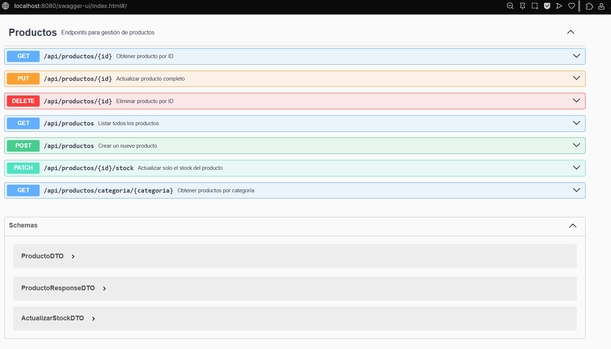
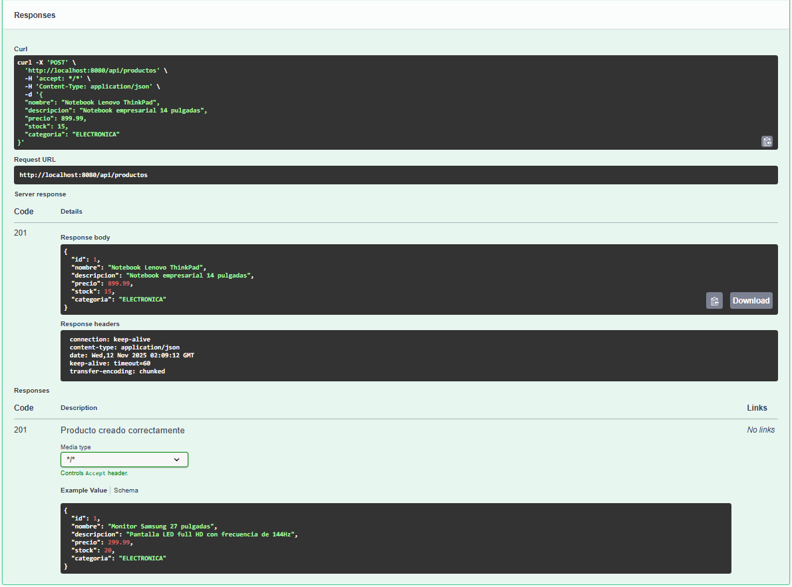
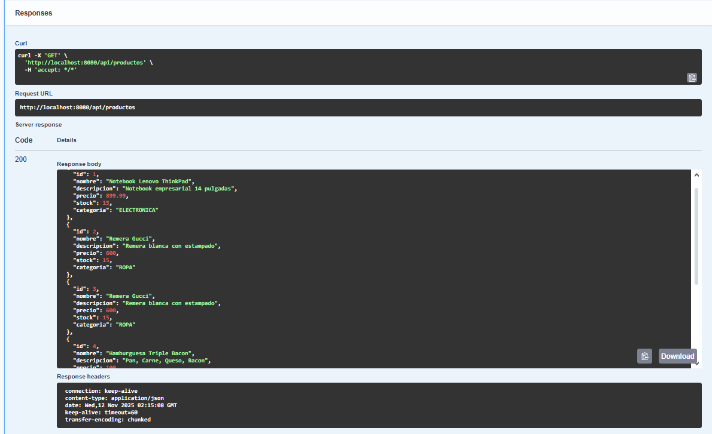
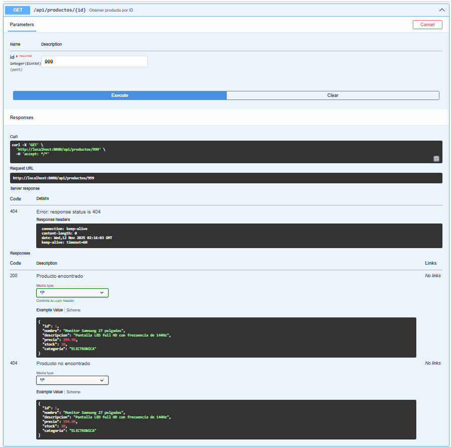
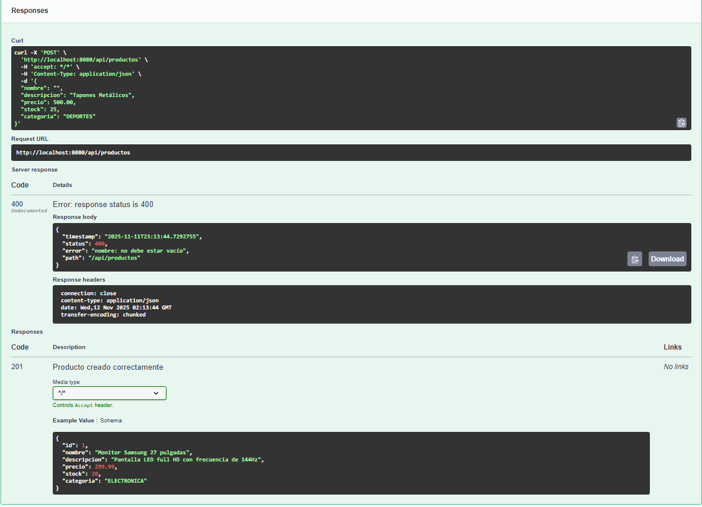
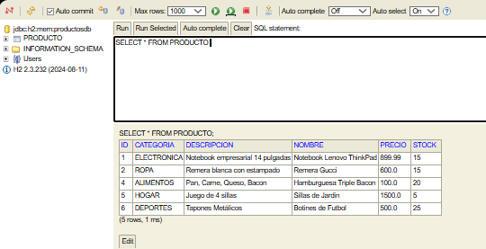

# 🛍️ API REST - Gestión de Productos

Proyecto desarrollado para la asignatura **Desarrollo de Software** de la carrera **Ingeniería en Sistemas de Información - UTN FRM**.

Este sistema provee una **API REST completa** para gestionar productos con operaciones CRUD, validaciones, manejo global de excepciones, capa de persistencia con JPA/H2 y documentación con Swagger (OpenAPI).

---

## ⚙️ Tecnologías utilizadas

- ✅ **Java 21**
- ✅ **Spring Boot 3.5**
- ✅ **Spring Data JPA** (persistencia)
- ✅ **H2 Database** (base de datos en memoria)
- ✅ **Spring Validation**
- ✅ **Springdoc OpenAPI / Swagger UI**
- ✅ **Lombok**
- ✅ **Maven** (gestión de dependencias)

---

## 🚀 Instrucciones para clonar y ejecutar
1. Clonar el repositorio:
```bash 
   git clone https://github.com/LisanCar/Productos-Api.git
   ``` 
2. Entrar a la carpeta del proyecto:
```bash
  cd productos-api
  ```
  
3. Compilar y ejecutar el proyecto:
```bash
  mvn spring-boot:run
  ```
  
4. Acceder desde el navegador a:

Swagger UI 👉 http://localhost:8080/swagger-ui/index.html 

Consola H2 👉 http://localhost:8080/h2-console

---
## 🌐 Endpoints principales

| Método | Ruta | Descripción |
|:-------:|:---------------------------------------------------|:---------------------------------------------|
| **GET** | `/api/productos` | Lista todos los productos registrados |
| **GET** | `/api/productos/{id}` | Obtiene un producto específico por su ID |
| **GET** | `/api/productos/categoria/{categoria}` | Filtra y lista los productos por categoría |
| **POST** | `/api/productos` | Crea un nuevo producto (requiere `ProductoDTO`) |
| **PUT** | `/api/productos/{id}` | Actualiza completamente un producto existente |
| **PATCH** | `/api/productos/{id}/stock` | Actualiza **solo el stock** de un producto |
| **DELETE** | `/api/productos/{id}` | Elimina un producto por su ID |

---

### ⚙️ Códigos de estado HTTP comunes

| Código | Significado |
|:-------:|:------------|
| **200** | Solicitud exitosa (OK) |
| **201** | Recurso creado exitosamente |
| **204** | Recurso eliminado exitosamente (sin contenido) |
| **400** | Error de validación de datos |
| **404** | Recurso no encontrado |
| **500** | Error interno del servidor |

---

## 📸 Capturas de pantalla

### 📘 Documentación completa



---

### ✅ Creación exitosa de producto (POST)



---

### 🔍 Listado de productos (GET)



---

### ⚠️ Producto no encontrado (Error 404)



---

### 🚫 Error de validación (Error 400)



---

### 🗄️ Consola H2 con datos persistidos



---

## 👤 Autor
Nombre: Lisandro Carrillo 

Legajo: 50831 

📧 carrillo.lisan@gmail.com 

📅 Año: 2025 
